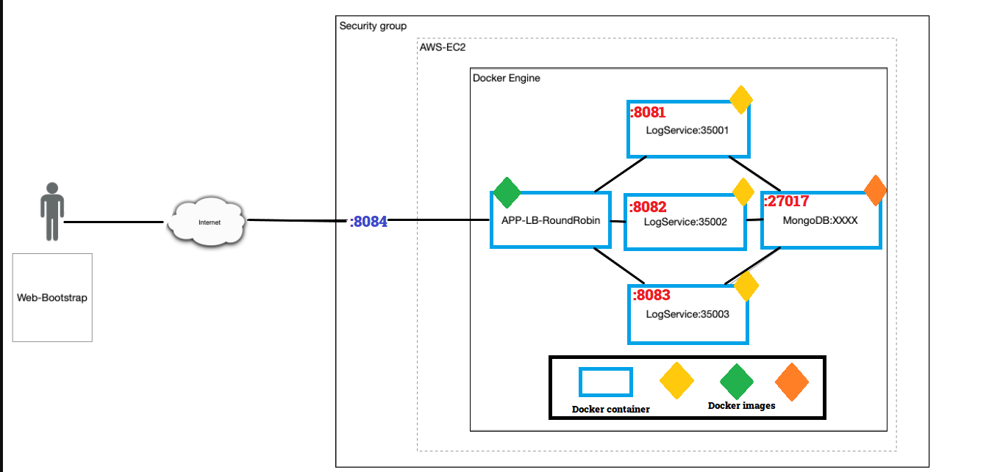
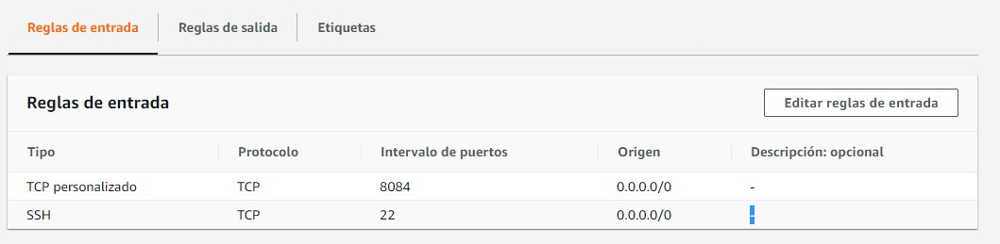

# LAB5-AREP  modularización con virtualización e Introducción a Docker y a AWS
Sparkweb + docker + load balancer architecture 
(DEMO Images and Gifs of the deployment are at the end of thsi file)

## Application Images:
The Docker Images are  located in:  
- Web: https://hub.docker.com/repository/docker/andresmarcelo7/arep5web
- Balancer: https://hub.docker.com/repository/docker/andresmarcelo7/arep5balancer

## Repos: 
This repo contains the Load Balancer code and on the next link you'll find  the web server repo [WEB SERVER GITHUB](https://github.com/AndresMarcelo7/WebServerDocker)
## Getting Started
These instructions will get you a copy of the project up and running on your local machine for development and testing purposes.
### Prerequisites
The things you need in order to run this proyect on your computer are:
- Maven
- Git  
- Docker

Make sure you have this installed with the commands
```
mvn --version
```
```
git --version
```
```
java -showversion
```
and 
```
docker --version
```

IMPORTANT : This project was developed with Java V1.8

### Deployment
The application was uploaded to an EC2 hosted on AWS, but for cost purposes the machine was deleted, AT THE END OF THIS FILE you'll find some gifs in order to show how the app was working.Also you can see the [DOCUMENTATION](/Documentacion.pdf) file to see the architecture used and some tests.

### Installing
Please clone this repository on your computer with the command:

```
git clone https://github.com/AndresMarcelo7/LAB5-AREP
```
Once finished, you must navigate into the project:
```
cd /LAB5-AREP
```
You must download both images (balancer and web) from dockerhub with the command:  
```
docker pull andresmarcelo7/arep5balancer:latest
docker pull andresmarcelo7/arep5web:latest
```
## Run

If you want to locally run the network please run the following command:
```
docker-compose up -d --scale web=3
```
If you're working on an Linux or Mac Machine, [install docker-compose](https://docs.docker.com/compose/install/).
In windows, docker-compose is already in docker desktop.

then go to localhost:8084 in order to access directly to the Load Balancer container.
If you want to access the web containers, you can go to localhost:8081,localhost:8082 and localhost:8083, but in AWS EC2 the 8084 port was the only oppened port for traffic.the applicattion will follow this architecture on AWS(For more information about how it worked on AWS plese visit the Documentation File):


## Demo
### AWS EC2 Console:

### Security Group:

### Browser:

